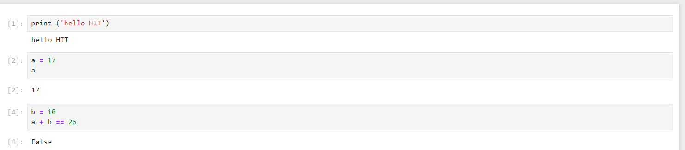
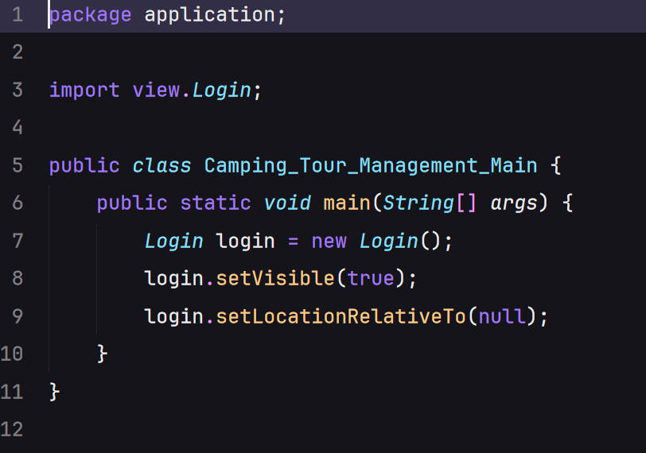
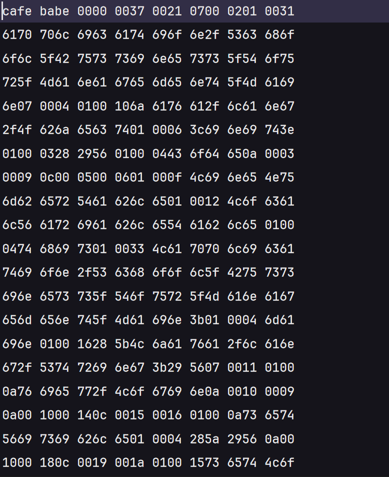

Câu 1 : Python cơ bản là ngôn ngữ thông dịch vì từng dòng lệnh trên python được thực thi tự động, không giống như Java - một ngôn ngữ biên dịch khi file .java phải được dịch sang file .class bởi trình biên dịch rồi mới được JVM xử lý.

thông dịch - Python

biên dịch - java

file class được tạo ra khi biên dịch 